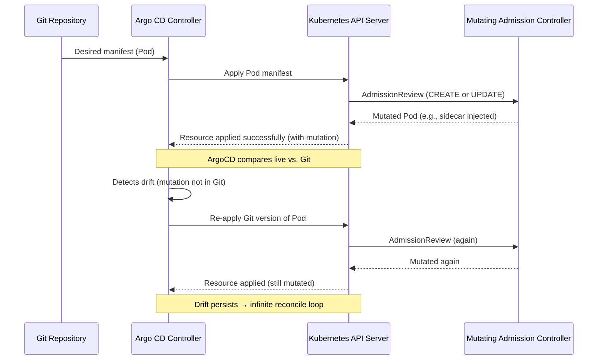

# Harmonizing Kubernetes Admission Controllers/Operators with GitOps Workflows


**TOC**
- [The Problem](#the-problem)
- [The Operator](#the-operator)
- [The Admission Controller](#the-admission-controller)
- [The GitOps Server](#the-gitops-server)
- [Demo](#demo)
    - [Setup ArgoCD](#setup-argocd)
    - [Deploy the App of Apps](#deploy-the-app-of-apps)
- [Conclusion](#conclusion)

## The Problem

GitOps tools like ArgoCD sync the desired state from Git to the actual state in the cluster. A reconcile is triggered when drift is detected between the two states. Admission Controllers mutate resources before they are created in the cluster. This can lead to a situation where the GitOps server and Admission Controller are fighting to control the same resources, leading to circular reconciliation loop.  

An example of such a situation would be if the GitOps tool is configured to deploy a Pod, and an admission controller is listening to create and update events on Pods and mutating them. Once the Pod passes through Admission Control, it is created with a different configuration than what was defined in Git. The GitOps tool then detects that the Pod is not in the desired state and tries to reconcile it back to the original state defined in Git which leads to an update event through admission, where it mutates the Pod again.  



The way to solve this problem, is to clearly define the roles of each component in your cloud-native architecture. By harmonizing Kubernetes Admission Controllers and Operators with GitOps workflows, you can create a secure, automated, and declarative architecture that leverages the strengths of each component.  

This blog has 3 major concepts:  
1. **GitOps**: A declarative approach to managing Kubernetes resources using Git as the single source of truth.
2. **Admission Controllers**: A Kubernetes feature that intercepts requests to the API server and can modify or reject them based on defined policies.
3. **Operators**: A method of packaging, deploying, and managing a Kubernetes application using custom resources and controllers.

We will use a Pepr operator for simplified, consistent WebApp deployment via a single configuration. An Admission Controller will enhance security by setting default security settings and preventing privileged pods. ArgoCD will manage the deployment and order of our webapp instances

> [!NOTE]
> You will need to fork this repo and clone it to your local machine. Make sure to replace all instances of `https://github.com/cmwylie19` your own repo. 

## The Operator

The role of the operator is to watch for the WebApp's CustomResource, look at the status to see if it is `Pending` or `Ready`. If it is `Pending`, it will pass through admission, leave the resource alone as the underlying resources are being deployed, once the underlying resources are deployed the operator will patch the status to be `Ready`. If a WebApp resource is in a `Ready` state, and the observed generation is less than the generation, the operator will update the status to `Pending`, and then deploy the underlying resources. The operator will also watch for changes to the CR and update the resources accordingly. See [capabilities/index.ts](./capabilities/index.ts) for the relevant code.


## The Admission Controller

The role of the admission controller is to enforce policies and security controls at the cluster level, ensuring that only compliant resources are deployed and validate the shape of the WebApp's CustomResource (CR). If the WebApp CR does not meet the correct criteria, it will be denied admission to the cluster. See [capabilities/index.ts](./capabilities/index.ts) for the code that does this.

## The GitOps Server

The role of the GitOps server is to provide a declarative, ordered, deployment of our entire stack. We will achieve this by using the App of Apps pattern. This pattern is a way to manage multiple applications in ArgoCD. It allows you to define a parent application, that contains multiple child applications, which can be deployed in a given order. Since our Operator will be patching the status of the WebApp CR, we do not have to worry about the admission controller and GitOps server fighting over the same resources since Argo will ignore differences in resource status. We will clearly define the boundaries of the GitOps server and when it should reconcile. However, our admission controller will be creating annotations on the WebApp CR to indicate that it has been processed. To ensure we do not get into a circular reconciliation loop, we will use `ignoreDifferences` in the ArgoCD application spec to ignore the annotations added by the admission controller. This will allow the GitOps server to reconcile the WebApp CR without being affected by the admission controller.


```yaml
apiVersion: argoproj.io/v1alpha1
kind: Application
metadata:
  name: webapps
  namespace: argocd
  annotations:
    argocd.argoproj.io/sync-wave: "2"
spec:
  ...
  ignoreDifferences: # ignore the annotations added by the admission controller
    - group: "application.pepr.dev"
      kind: "WebApps"
      jsonPointers:
        - /metadata/annotations
```

## Demo

To start, we will be using a local Kubernetes cluster with k3d. You can use any Kubernetes cluster you like, but for the sake of simplicity, we will be using k3d.

```bash
npm run k3d-setup
```


### Setup ArgoCD

1. Install ArgoCD in your cluster. You can follow the [official documentation](https://argo-cd.readthedocs.io/en/stable/getting_started/) for installation instructions.

```bash
kubectl create namespace argocd
kubectl apply -n argocd -f https://raw.githubusercontent.com/argoproj/argo-cd/stable/manifests/install.yaml
```

2. Port-forward the argocd-server service to access the ArgoCD UI.

```bash
kubectl port-forward svc/argocd-server -n argocd 3333:80
```

3. Get the initial admin password.

```bash
kubectl get secret argocd-initial-admin-secret -n argocd -ojsonpath="{.data.password}" | base64 -d | pbcopy
```

4. Signin  to the ArgoCD UI at [http://localhost:3333](http://localhost:3333) using the username `admin` and the password you copied in the previous step. Click advanced and sign in. (Insecure certificate warning)


### Deploy the App of Apps

The [App of Apps pattern](./k8s/app-of-apps.yaml) is a way to manage multiple applications in ArgoCD. It also allows us to define the order of the applications. 

We are looking to deploy the following applications in order:
- [WebApp CRDs](./k8s/apps/crds.yaml)
- [WebApp Operator](./k8s/apps/controller.yaml)
- [WebApp Instances](./k8s/apps/webapps.yaml)

Before we deploy the applications, make sure you are looking in the ArgoCD UI to visualize the applications.

```bash
kubectl apply -f k8s/app-of-apps.yaml
```

Once the applications are all `synced`, lets look at the `webapps` namespace.

Lets look at the english-light WebApp instance.

```bash
> kubectl get wa,all -n webapps
NAME                                        AGE
webapp.application.pepr.dev/english-light   40s
webapp.application.pepr.dev/spanish-dark    40s

NAME                                 READY   STATUS    RESTARTS   AGE
pod/english-light-58c4bdf4d5-5q75r   1/1     Running   0          40s
pod/spanish-dark-74f9855554-59rwc    1/1     Running   0          40s

NAME                    TYPE        CLUSTER-IP      EXTERNAL-IP   PORT(S)   AGE
service/english-light   ClusterIP   10.43.220.207   <none>        80/TCP    40s
service/spanish-dark    ClusterIP   10.43.78.1      <none>        80/TCP    40s

NAME                            READY   UP-TO-DATE   AVAILABLE   AGE
deployment.apps/english-light   5/5     5            5           40s
deployment.apps/spanish-dark    1/1     1            1           40s

NAME                                       DESIRED   CURRENT   READY   AGE
replicaset.apps/english-light-58c4bdf4d5   5         5         5       40s
replicaset.apps/spanish-dark-74f9855554    1         1         1       40s
```

Lets see the status of the WebApp CR. 

```bash
> kubectl get wa english-light -n webapps -o yaml

status:
  conditions:
  - lastTransitionTime: "2025-05-09T20:14:50.121Z"
    observedGeneration: 1
    reason: Processing
    status: Pending
  - lastTransitionTime: "2025-05-09T20:14:50.142Z"
    observedGeneration: 1
    reason: Reconciled
    status: Ready
```

We can see from the `status.conditions` above that it was `Pending` and then `Ready`. This means the Operator created the resources and the admission controller enforced the policies. Similarly you could look at the events by describing the resource.

Let's see how the webapp works.

```bash
kubectl port-forward svc/english-light -n webapps 8080:80
```

Then open a browser and go to [http://localhost:8080](http://localhost:8080). You should see the webapp running, see a white background with english text. If we look at the pods we see there is a single replica.

```bash
kubectl get pods -n webapps
```


Lets update that resource to have 5 replicas instead of 1 by editing the file `k8s/webapps/english-light.yaml` and changing the replicas from 1 to 5 and change theme to `dark`. Then, push your changes to git.

Give the ArgoCD server a few minutes to reconcile the changes. You can see the status of the application in the ArgoCD UI. Alternatively, you can force sync the application by clicking the `Sync` button in the UI.

```bash
> kubectl get po -n webapps
NAME                            READY   STATUS    RESTARTS   AGE
english-light-9c5985d8c-hn4qh   1/1     Running   0          2m27s
english-light-9c5985d8c-nfds9   1/1     Running   0          2m27s
english-light-9c5985d8c-nrfbs   1/1     Running   0          2m27s
english-light-9c5985d8c-z8lhq   1/1     Running   0          2m26s
english-light-9c5985d8c-zjp69   1/1     Running   0          2m26s
spanish-dark-5b5d5f8849-ttnq4   1/1     Running   0          13m
```

If we describe the `english-light` webapp we can see the operator has reconciled the changes again.

```bash
Events:
  Type    Reason                    Age    From           Message
  ----    ------                    ----   ----           -------
  Normal  InstanceCreatedOrUpdated  14m    english-light  Pending
  Normal  InstanceCreatedOrUpdated  14m    english-light  Reconciled
  Normal  InstanceCreatedOrUpdated  2m59s  english-light  Pending
  Normal  InstanceCreatedOrUpdated  2m59s  english-light  Reconciled
```

The Pods that the operator is deploying are going through admission control, and the MutatingWebhook is mutating the resources to assign a container security context of `allowPrivilegeEscalation: false`.

```yaml
> kubectl get pod -n webapps -l pepr.dev/operator=spanish-dark -o jsonpath="{.items[0].spec.containers[*].securityContext}"
{"allowPrivilegeEscalation":false}
```

If we try to deploy a pod running with privileged mode, the admission controller will reject the request.

```yaml
kubectl apply -f -<<EOF
apiVersion: v1
kind: Pod
metadata:
  creationTimestamp: null
  labels:
    run: testing123
  name: testing123
spec:
  containers:
  - image: nginx
    name: testing123
    resources: {}
    securityContext:
      allowPrivilegeEscalation: true
  dnsPolicy: ClusterFirst
  restartPolicy: Always
status: {}
EOF
Error from server: error when creating "STDIN": admission webhook "pepr-pepr-with-argo.pepr.dev" denied the request: Privilege escalation is disallowed
```


## Conclusion

In summary, we have clearly defined the following roles:
- ArgoCD is responsible for syncing the state of the WebApp resources in Git, with the actual state in the cluster. It is responsible for deploying the CRDs, the Operator, and the WebApp instances.
- The operator is responsible for managing the WebApp instances. Once it sees a WebApp CR, it reads the CR and deploys the underlying resources.
- The Admission Controller is in change of the global security posture of the cluster and the shape of the WebApp CR.


With these responsibilities clearly defined, we can ensure that:
- The GitOps server and Admission Controller are not fighting over the same resources. 
- We can declaritively manage the state of our cluster using GitOps.
- We can enforce security policies at the cluster level using Admission Controllers which allows us to keep our manifests simple and consistent across the board.


